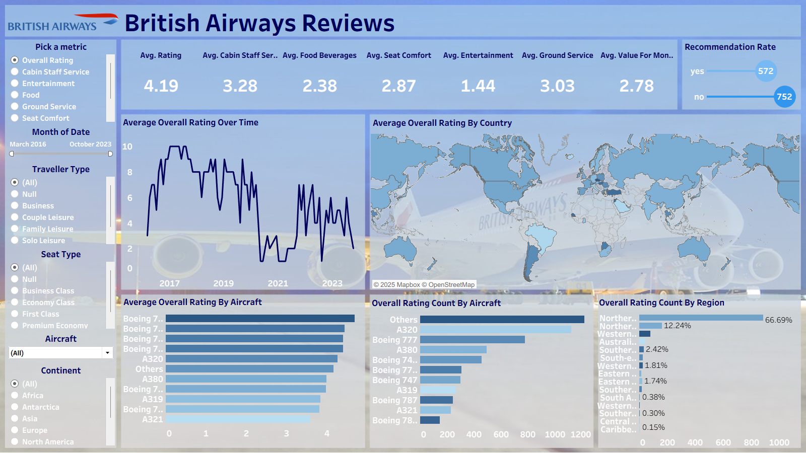

# ✈️ British Airways Review Dashboard

This interactive Tableau dashboard explores customer reviews for British Airways, providing insights into passenger experiences across various service metrics such as seat comfort, food, entertainment, and ground service.

### 📊 Some Key Highlights:
- **Dynamic Metric Selection**: Switch between various rating aspects (e.g., Seat Comfort, Food, Entertainment) using a custom selector.
- **Time-Based Trends**: Visualize how average ratings have changed over time.
- **Geographical Analysis**: View average ratings by country and rating count by region.
- **Aircraft Comparison**: Analyze average ratings and review counts across different aircraft models.
- **Recommendation Split**: See how many customers would recommend the airline.

### 🌍 Live Dashboard:
👉 [View on Tableau Public](https://public.tableau.com/views/British-Airways-Reviews_17539653459170/British-Airways-Reviews?:language=en-US&:sid=&:redirect=auth&:display_count=n&:origin=viz_share_link)  

### 🖼️ Dashboard Preview:

